# Fishi

A calm, black and white messenger for Android, built with Flutter and Supabase. English and Portuguese (Brasil).

<p>
  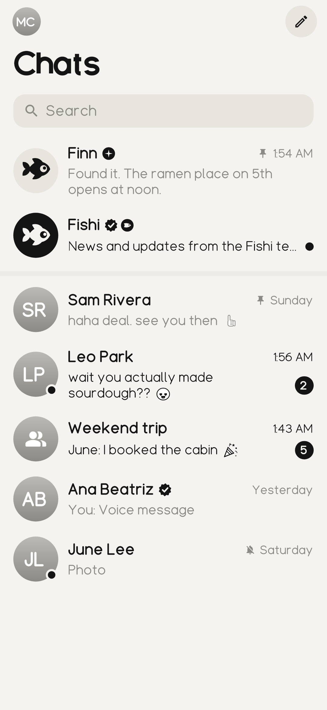
  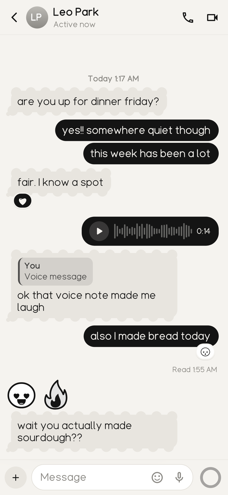
  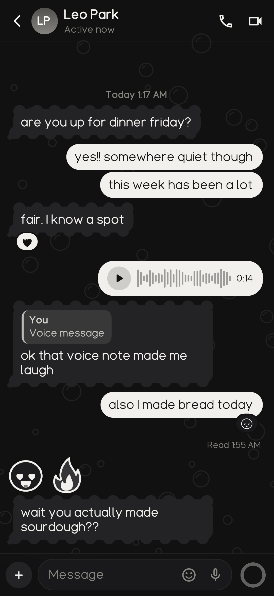
  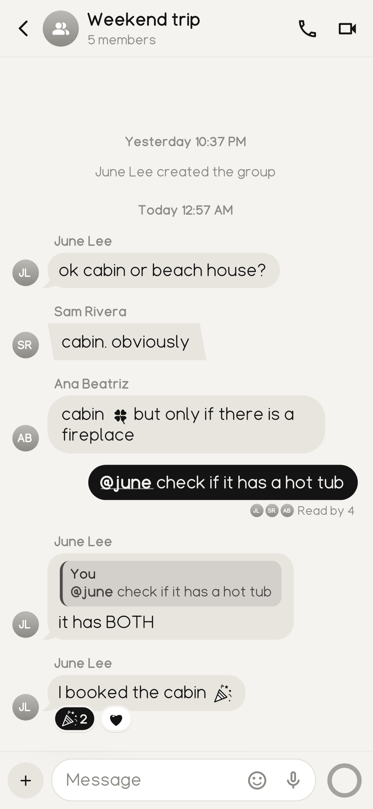
</p>

## What it does

- One-on-one chats and groups, @mentions with autocomplete, swipe to reply, long-press reactions, photos, voice notes, typing indicator, read receipts and unsend.
- Custom chat bubbles everyone can see: 8 shapes plus a color picker, in the bubble studio.
- Finn, the built-in AI friend. Pinned at the top, or mention `@finn` in any chat.
- Voice and video calls over LiveKit, with an incoming call screen.
- Local notifications while the app is running, no Firebase.
- Light, dark and auto themes, optional chat backgrounds.
- Three typefaces and a set of 186 black and white chibi emoji, all drawn in code.
- Admin panel for @fishi: stats, announcements, Finn settings, watch list and flagged messages.
- 18+ only. Only messages matching watch-list terms, or under-18 age answers, can be reviewed by the Fishi team.

<p>
  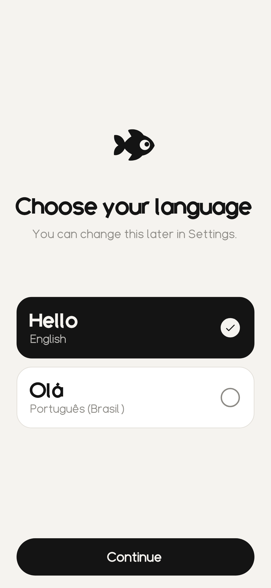
  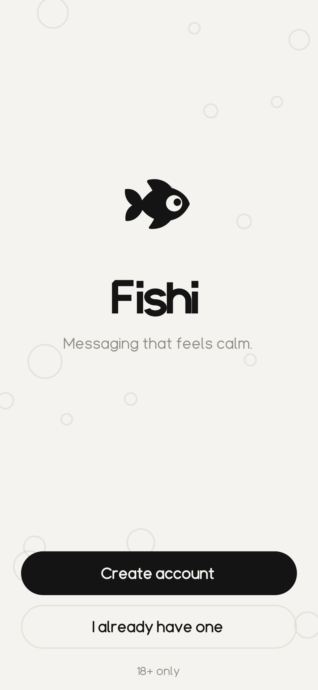
  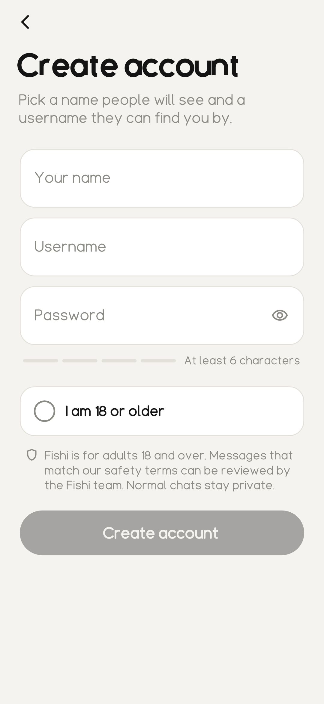
  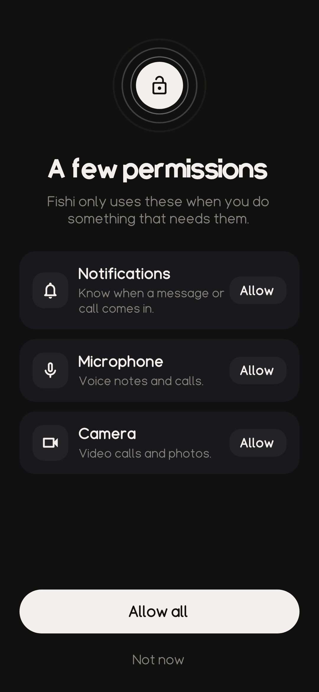
</p>

<p>
  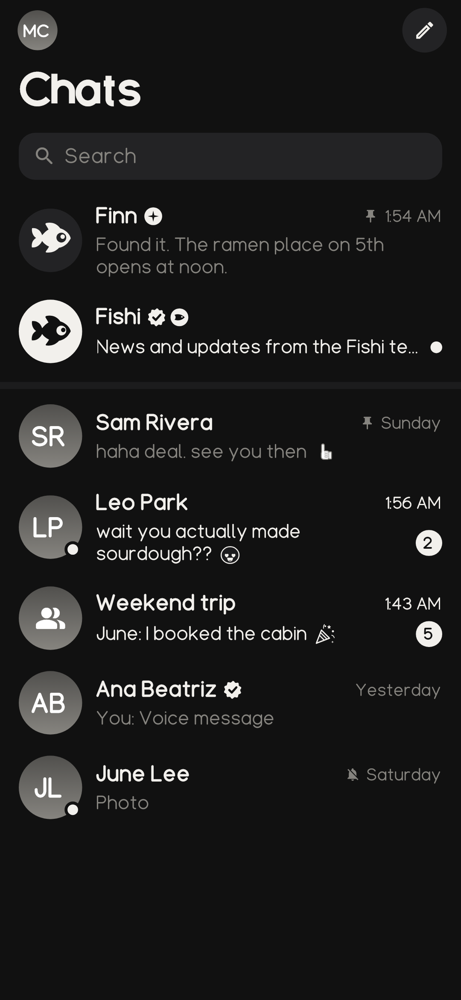
  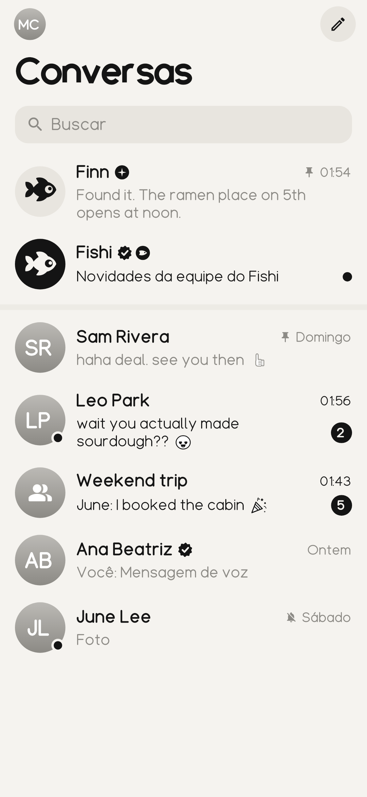
  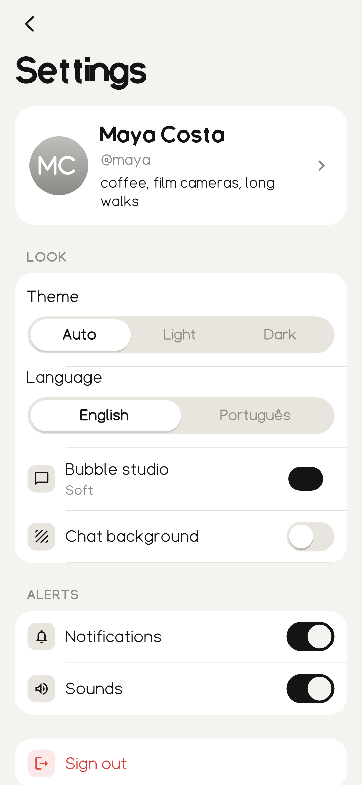
  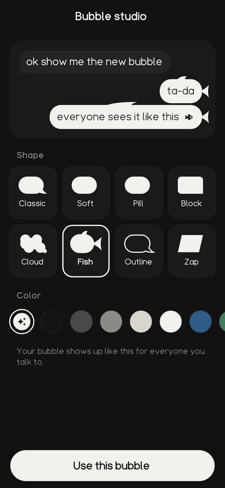
</p>

<p>
  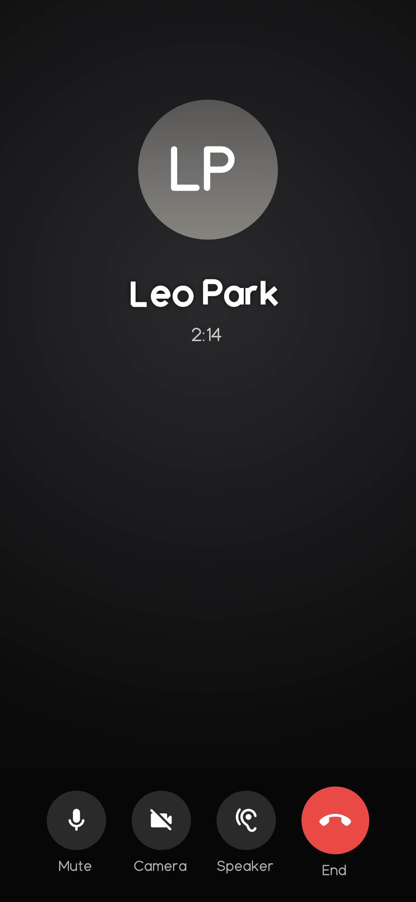
  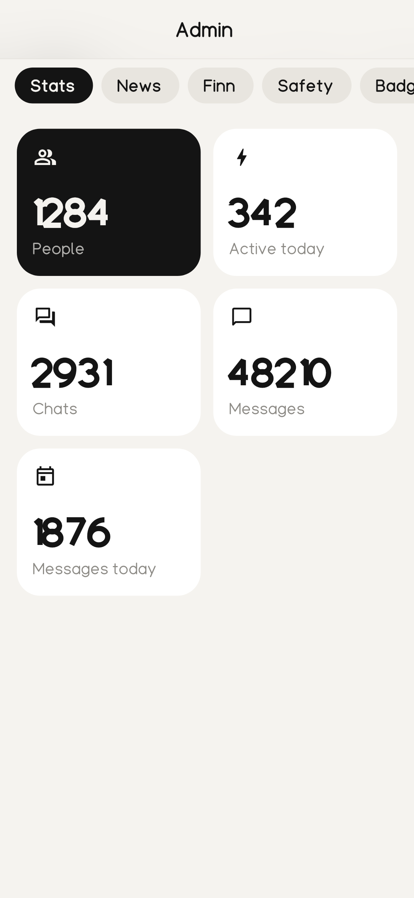
  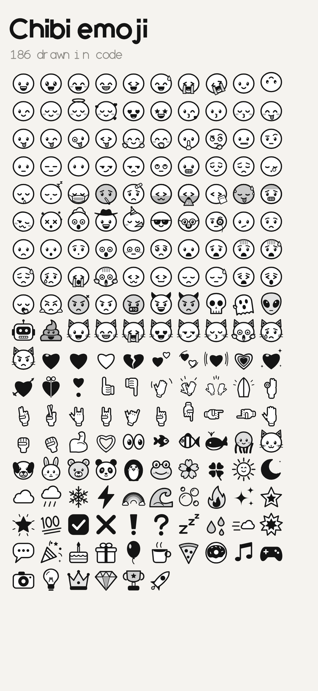
  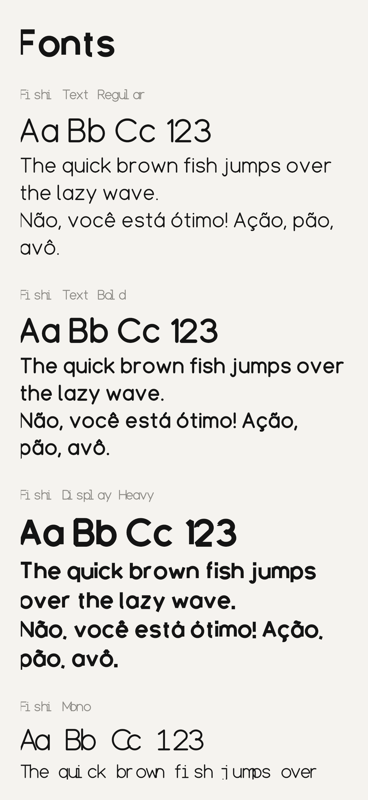
</p>

## Setup

Create `.env` in the project root:

```
SUPABASE_URL=https://rlupbwqnpesdtkhuhpsr.supabase.co
SUPABASE_PUBLISHABLE_KEY=<publishable key>
```

Run or build with it:

```
flutter run --dart-define-from-file=.env
flutter build apk --release --split-per-abi --target-platform android-arm64 --dart-define-from-file=.env
```

The database lives in `supabase/migrations` and the edge functions (`finn`, `livekit-token`) in `supabase/functions`.

## Fonts

Fishi Text, Fishi Display and Fishi Mono are generated from stroke skeletons:

```
pip install fonttools skia-pathops
python3 tool/fonts/build_fonts.py
```

## Screenshots

The images above are real screens rendered by Flutter golden tests:

```
flutter test --update-goldens test/screenshots_test.dart
```
